 

 

## ✦ ABOUT ME

Systems Engineering Student | Cloud Computing Enthusiast | AWS Certified

Passionate about building scalable cloud solutions and exploring 
the intersection of Cloud Infrastructure + AI/ML. Currently focused 
on deepening my expertise in AWS architecture, DevOps, and automation.

AWS Certified Cloud Practitioner | Continuous Learner | Open to internships & collaborative projects

Specializing in: Cloud Computing · Software Development · DevOps · Machine Learning · Artificial Intelligence.

 

## ⚡ TECH STACK

## 📊 GITHUB STATISTICS

 

 

## 🎯 GOALS & VISION

✧ ☁️ Master Cloud Architecture (EC2, S3, Lambda, RDS, VPC)

✧ 🤖 Specialize in ML & AI implementations

✧ 🚀 Build production-ready solutions

✧ 📖 Contribute to open-source

✧ 📚 Continuous learning & 

### `✦ Committed to excellence in every project ✦`

 

**[LinkedIn](https://www.linkedin.com/in/sebastián-g-15ab7b343)** • **[GitHub](https://github.com/SebastianGarcia333)** • **[Email](mailto:jsebastian579@hotmail.com)**

Thanks for visiting ✧

